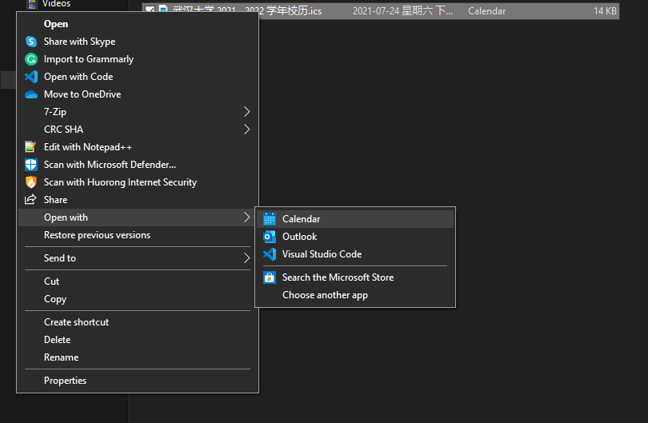
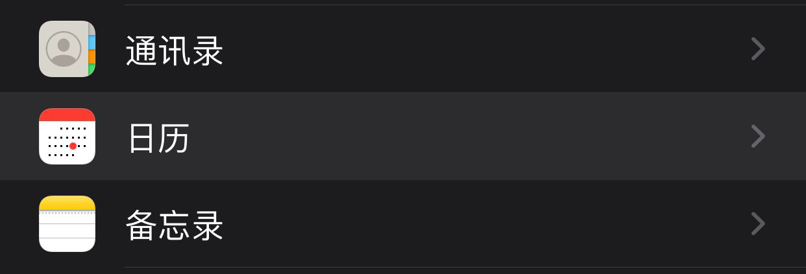
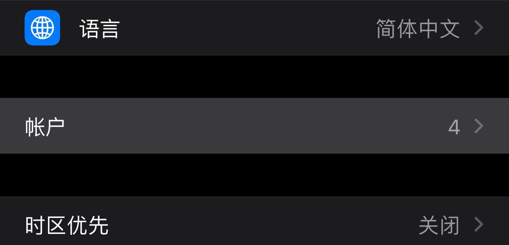
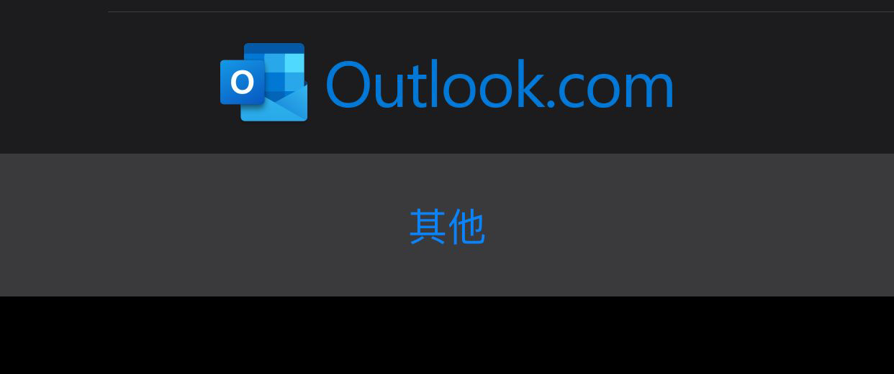
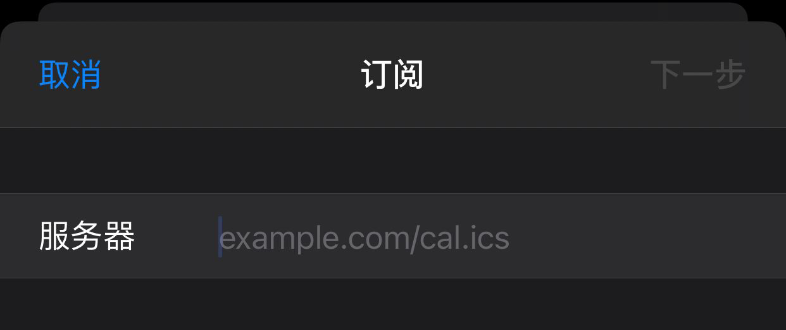
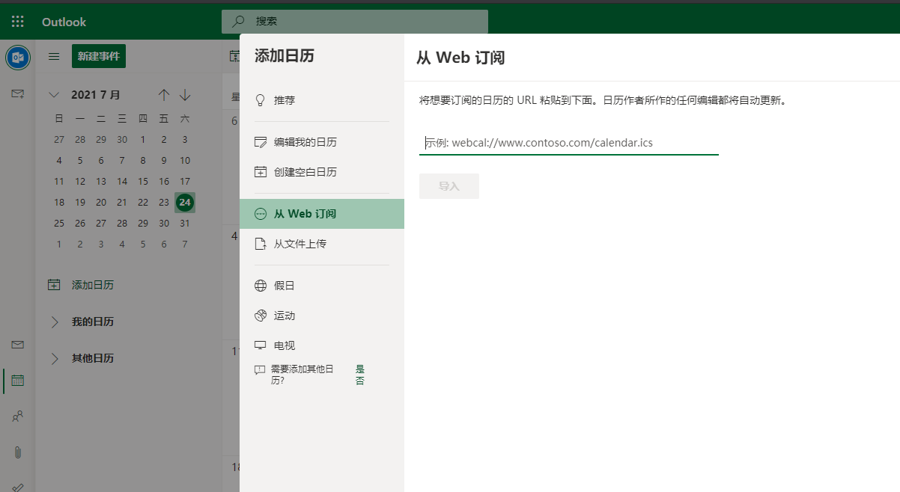

# 使用方法

## Windows 下使用不更新的版本

### 使用要求
- Windows 8 以上的版本
- 拥有系统日历应用

### 使用方法
1. 将鼠标点击到日历文件
2. 右键点击鼠标
3. 打开方式
4. 选择 “日历”

## iOS 下使用会更新的版本

### 使用要求
- 不太老的 iOS 系统应该都支持

### 使用方法
参考苹果官方介绍：<https://support.apple.com/zh-cn/guide/iphone/ipha0d932e96/ios>

1. 打开系统设置应用 “设置”
2. “日历” 应用设置
    
2. "账户"
    
3. "添加账户"
    
4. "其他"
    
5. "添加已订阅的日历"
    
6. 在“服务器”中输入我们的日历地址
    

## MacOS 下使用不更新的版本

### 使用方法
1. 使用系统日历打开文件

## 使用 Microsoft Outlook 日历添加不更新的版本

### 使用要求
- 个人经验 Office 2003 已经支持这个功能了

### 使用方法
1. 使用 Outlook 打开日历文件

## 使用 GMail 日历订阅会更新的版本

### 使用方法
1. 打开 <https://calendar.google.com/calendar/u/0/r/settings/addbyurl>
2. 输入我们的日历地址

## 使用 Outlook 日历订阅会更新的版本

1. 打开 <https://outlook.live.com/calendar/>
2. 点击 “添加日历”
3. “从 Web 订阅”
4. 输入我们的日历地址
